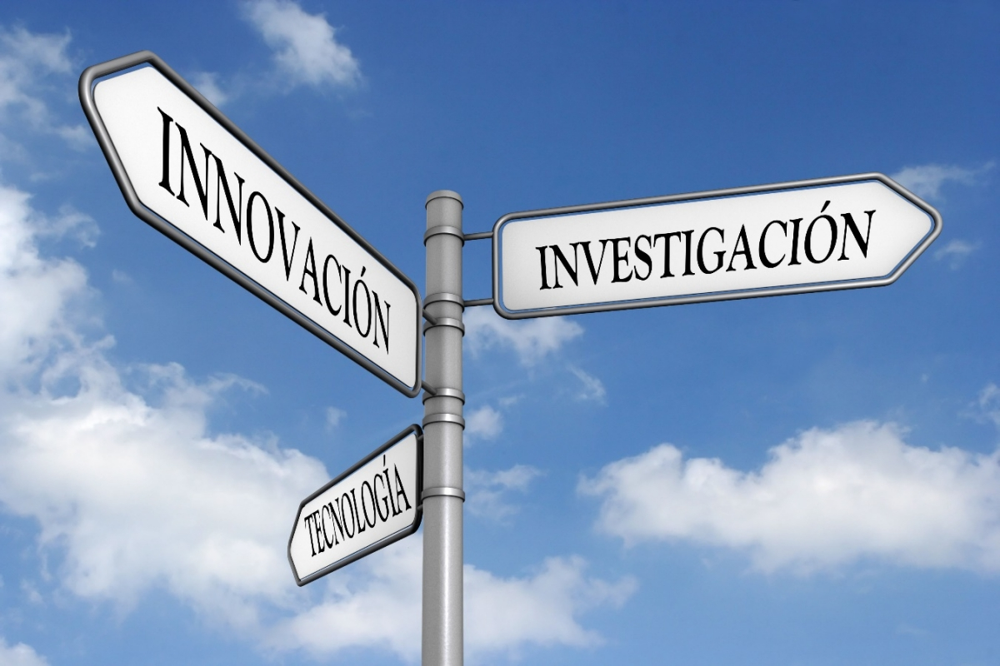

# Estado del arte

El estado del arte de su proyecto se sitúa en la convergencia del Internet de las Cosas (IoT) y la movilidad urbana inteligente, donde la identificación por radiofrecuencia y NFC se han consolidado como estándares globales para la gestión de activos en entornos controlados. Actualmente, la integración de microcontroladores de alto rendimiento como el ESP32-C6, que soporta protocolos de comunicación modernos, con módulos especializados como el PN532, permite la creación de ecosistemas de seguridad robustos que superan las barreras de los sistemas de vigilancia tradicionales. Investigaciones contemporáneas en el área de Smart Campus destacan que la trazabilidad en tiempo real, vinculada a bases de datos relacionales y aplicaciones móviles personalizadas, no solo optimiza el flujo de vehículos como bicicletas y monopatines, sino que también proporciona una capa de validación biométrica y de estado (entrada, salida o préstamo) que es fundamental para mitigar el riesgo de pérdida y mejorar la experiencia del usuario institucional.

## Ejemplos:
### 1. Sistema EnCicla (Medellín, Colombia)
Este es el ejemplo más cercano y pertinente, ya que es un sistema de bicicletas públicas operando en el país.

* **Implementación:** Los usuarios se registran previamente en una base de datos entregando sus datos personales y fotografía. Para retirar o devolver una bicicleta, utilizan una tarjeta inteligente con tecnología NFC/RFID (la tarjeta Cívica) acercándola a un tótem lector en la estación.
* **Conexión con tu proyecto:** EnCicla utiliza exactamente el flujo que ustedes proponen: NFC → Microcontrolador en la estación → Base de Datos → Validación de estado (prestada/devuelta).

### 2. BiciRegistro (España)
Es el sistema nacional de registro de bicicletas en España, impulsado por la Red de Ciudades por la Bicicleta.

* **Implementación:** Su objetivo principal es disuadir el robo y facilitar la recuperación. El usuario sube a una plataforma web/app fotos de su bicicleta, detalles (color, marca) y sus datos personales. Luego, se adhiere una etiqueta RFID/NFC de alta seguridad al marco de la bicicleta. Si la policía la encuentra, escanea la etiqueta y la base de datos relacional muestra inmediatamente la foto del propietario legítimo.
* **Conexión con tu proyecto:** Esto valida la viabilidad de su propuesta de tener un "expediente digital" por bicicleta (fotos del vehículo y del dueño) asociado a un UID de una etiqueta.

### 3. Empresas de Micromovilidad (Lime, Bird, Tier)
Aunque estos usan GPS y códigos QR principalmente, su arquitectura IoT en el fondo es idéntica a lo que ustedes están construyendo con el ESP32.

* **Implementación:** Cada patineta tiene en su interior un microcontrolador (un "cerebro" IoT equivalente a su ESP32) conectado a internet. Cuando el usuario interactúa desde su aplicación móvil, la app envía una orden a la base de datos en la nube (backend), la cual se comunica con el microcontrolador de la patineta para desbloquearla.
* **Conexión con tu proyecto:** Muestra cómo la triada Hardware en sitio + App del Usuario + Servidor Central es el estándar de oro en la industria de la movilidad compartida.

### 4. Sistemas de Control de Acceso Corporativo (HID Mobile Access / MIFARE)
En edificios corporativos y universidades de alta tecnología, el control de acceso ha dejado atrás las llaves físicas.

* **Implementación:** Los empleados usan sus celulares (con la antena NFC del teléfono) o tarjetas físicas para pasar por torniquetes. El lector NFC (equivalente a su PN532) lee la credencial y valida criptográficamente que no sea un clon.
* **Conexión con tu proyecto:** Esto se relaciona con el área de mejora de la seguridad. Estos sistemas escriben "llaves" encriptadas dentro de los bloques de memoria de la tarjeta (las "Páginas de Usuario" 4-129 que ustedes mencionaron en su informe) para que no baste solo con copiar el número de serie de fábrica.